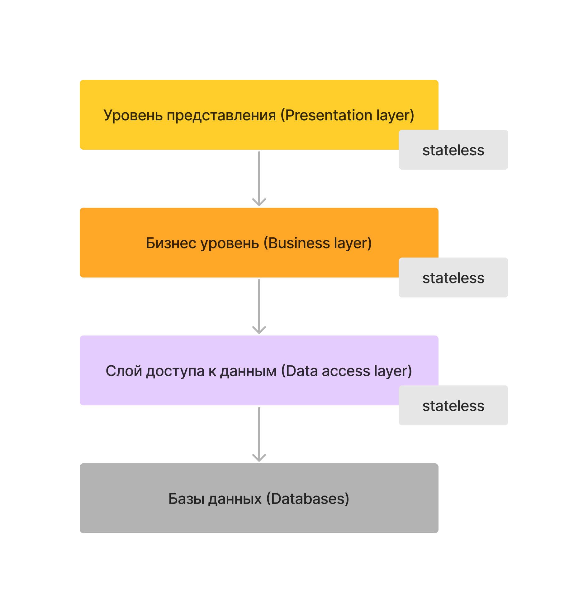
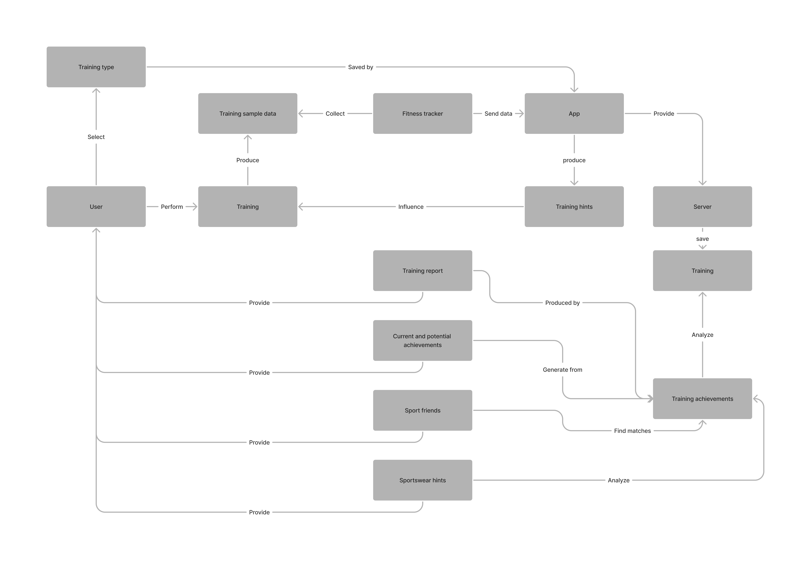

[Heading](../heading.md)

[Previous chapter](02-functional-requirements.md)

[Next chapter](05-risks.md)

# Разработка концептуальной архитектуры

При выборе архитектуры важно учитывать имеющийся бюджет, но из-за недостатка информации, считаем, что он у нас неограничен. Архитектуру строить будем исходя из максимальных требований по различным характеристикам вроде:
* Количество пользователей
* Просмотры в секунду
* Покупки в секунду

Также при выборе архитектуры должны влиять:
* Требования безопасности (личные или платёжные данные)
* Требования надёжности (Мы не хотим, чтобы всё рухнуло, если какая-либо сервис не работает)

Наш проект является достаточно большим, c обширным функционалом и изначально делать его монолитом -- не самая лучшая идея по следующим причинам:
* Ограниченный выбор технологий (монолиты обычно пишутся используя один язык программирования)
* Сложность совместной разработки
* Сложность поддержки
* Отсутствие эластичности
* Сложности с выкатыванием новых версий и масштабированием

Также при использовании монолита достаточно сложно соответствовать требованиям безопасности и надёжности.

Узким местом Service-oriented архитектуры является Enterprise Server Bus. Эта часть является достаточно громоздкой и тяжело поддерживаемой.

Очевидным недостатком Space-based архитектура является поддержание консистентности данных. На данном этапе серьёзных требований к консистентности у нас нет, но не хочется на этапе выбора архитектуры лишать себя такой возможности.

Service-based отличная архитектура, но недостатком является база данных в единичном экземпляре, в которую пишут все сервисы. Мы бы хотели иметь чуть более отказоустойчивое решение. Для этого достаточно, чтобы сервисы имели несколько баз данных. Так мы получаем гибкое сервис-ориентированное решение.

У Event-driven есть свои достоинства и недостатки
К достоинствам можно отнести:
* Независимость разработки сервисов
* Простота масштабирования
* Неблокирующее общение
* Хорошая отказоустойчивость

Но и недостатки также есть:
* Обработка ошибок не является чем-то тривиальным
* Наличие дополнительных сервисов для пересылки сообщений

Event-driven может использоваться в некоторых местах в нашем решении, например оповещения любого вида, обновление статусов.

Решение планируется оформить как Service-based с уникальной базой данных для каждого домена.

## N-tier архитектура

Планируется, что архитектура будет выглядеть как классическое N-tier решение со следующими иерархиями:

1. Уровень представления. Отвечает формирование и отправку готовых данных для браузера/приложения
2. Уровень бизнес логики
3. Слой доступа к данным. Абстракция уровня баз данных. Данный уровень знает откуда взять нужные данные, знает всё про местоположение/шардинг/реплики.
4. Базы данных. Хранит непосредственно все данные.

Все уровни кроме баз данных должны быть stateless. На этих уровнях возможно только кеширование результатов.

В разработке архитектуры планируется опираться на принципы DDD (Domain driven design). То есть планируется разбить проект на домены, те в свою очередь на поддомены.

Несмотря на то, что разработка доменной модели является более затратной на начальном этапе чем транзакционный и табличный подходы, она окупит себя в дальнейшем.
Приложение является достаточно большим и важно изначально правильно разбить систему на домены, чтобы не заниматься рефакторингом (который скорее всего будет дорогостоящим) в будущем.

Также важно правильно выделить core домены нашей архитектуры так как они будут ядром нашего проекта.

## Доменные области

У нас планируются следующие доменные области:

1. ССС. Отвечает за ССС часть проекта. В неё входят: информация о себе, сообщения между пользователями, функционал ленты и т.д.. Это основной домен, интегрирующийся с остальными доменами
1. Домен Обработки Тренировочных Данных. В этот домен входит всё, что связано с обработкой данных тренировок, достижениями и статистикой.
1. Центр Геймификации. В этот домен входит всё, что связано с виртуальным персонажем пользователя

## Интеграция с фитнес устройствами

Мы заинтересованы в том, чтобы пользователи могли сами править баги в текущих и подключать новые фитнес устройства к нашей системе.
Для этого нужно сделать драйвера устройств open-source, зафиксировать API и сделать к нему хорошую документацию, что подразумевает API-first подход.

## Концептуальная архитектура тренировки

