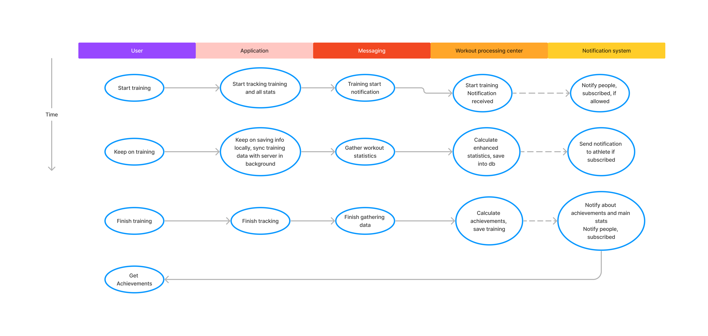
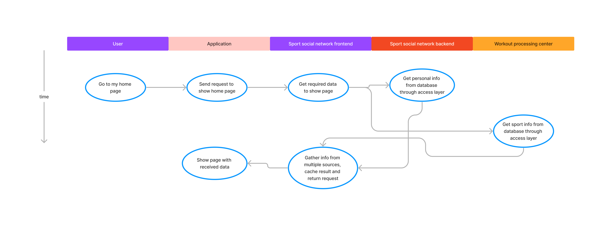

[Heading](../heading.md)

[Previous chapter](11-adr.md)

[Next chapter](13-basic-architecture.md)

# Описание сценариев использования приложения

## Сбор данных трекинг устройства

При начале тренировки данные сразу собираются и отправляются на сервер. Это нужно для возможности мониторинга спортсменов тренерами. Также это пригодится для сравнения статистики спортсменов онлайн.

## Данные о спортсмене из соцсети

Рассмотрим пример, когда хотим взять данные нашей домашней странички.
Допустим мы хотим отобразить как информацию о владельце, которая хранится в домене спортивной социальной сети, так и информацию о достижениях из домена обработки тренировок.

Граф будет выглядеть следующим образом:

Заметим, что frontend часть ССС также занимается кешированием данные. Для инвалидации данных мы наблюдаем за нашим логом тренировок. В случае если есть новые данные по спортсмену, кеш инвалидируется.

## Интеграция со сторонними приложениями

Для того, чтобы интеграция с уже существующими приложениями происходила максимально гладко, желательно, чтобы они все находились в одной инфраструктуре.

Интеграция с приложением покупок происходит следующим образом:
* У нашего приложения есть вкладка приобрести товар, которая переводит на наше приложение или же на его скачивание в случае его отсутствие
* В будущем желательно будет разработать нейросеть, определяющую тип товара по фотографии на спортсмене и, при нажатии на распознанный товар, переводить пользователя в магазин покупок

Для интеграции с узкоспециализированными приложениями для каждого вида спорта будем делать всплывающую подсказку-напоминание о том, что у нас есть приложение для этого вида спорта, которое поможет улучшить достижения в этом спорте с предложением его скачать/открыть Всплывающая подсказка будет появляться когда спортсмен будет просматривать результаты тренировок по этому виду спорта.

## Геймификация

В качестве геймификации, можно создать пользователю его виртуального аватара.
В игре будет существовать внутриигровая валюта, которую можно пополнить, как занимаясь спортом, выполняя миссии, так и за реальную валюту.
Выполнение миссии может контролироваться как по датчикам, так и в будущем по камере при использовании камеры и идентификацию пользователя и того, что он делает по камере.

Главным персонажем игры будет аватар пользователя.
Характеристики аватара будут зависеть от успехов в тренировках самого пользователя.
Аватара возможно:
* Наряжать. При покупке реальной одежды, аналогичная одежда также появляется у вашего аватара. Также можно покупать как за внутреннюю, так и за игровую валюту.
* Прокачивать характеристики. Это возможно делать самому занимаясь спортом, получая достижения вы также прокачиваете своего аватара.
* Соревноваться с другими пользователями (симуляция игры с небольшими "случайностями")

## Скачивание интересующих нас данных

Пользователь должен иметь возможность закешировать ленту, карту для бега, какую-то статью, свои результаты, чтобы иметь доступ ко всему этому без интернета. Также должна быть возможность отключения кеширования.
