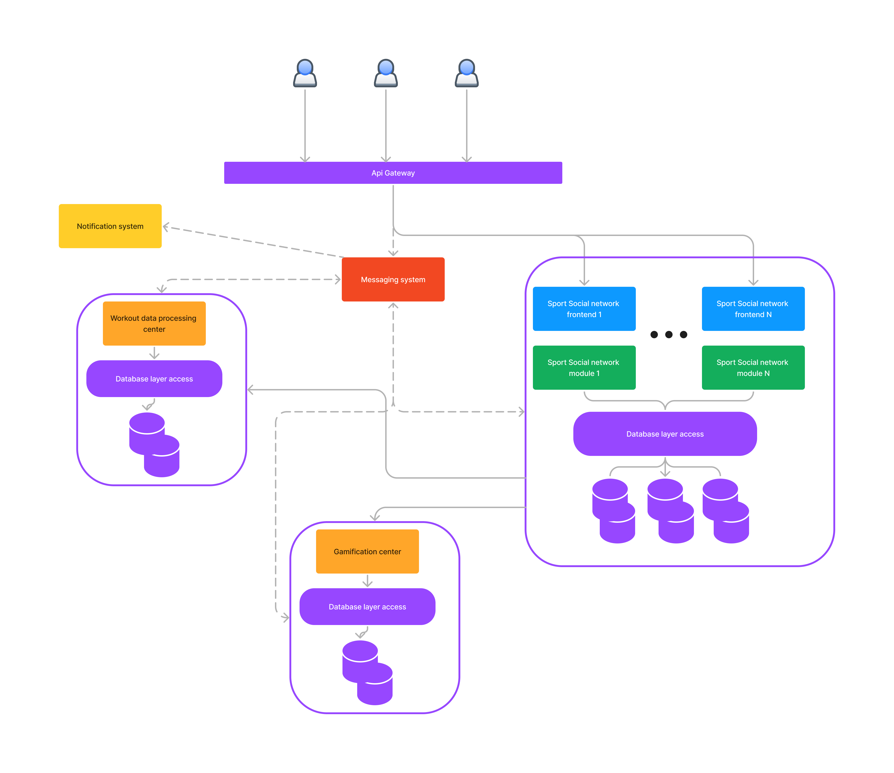

[Heading](../heading.md)

[Previous chapter](12-use-cases.md)

[Next chapter](14-representation.md)

# Базовая архитектура с учётом ограничений бизнес-требований, НФТ, выбранной архитектуры, адресация атрибутов качества

В данной архитектур указаны только компоненты, являющиеся MVP продукта.

### API Gateway
Выполняет функцию точки входа и выхода в нашу инфраструктуру.
Основные задачи:
* Безопасность (https, data leak prevention, WAF)
* Аутентификация
* Авторизация
* Мониторинг
* API ключи для приложений сторонних разработчиков (пригодится в будущем)

### Messaging system
Лог, содержащий 
* Данные о тренировках
* Notification сообщения, которые будут обрабатываться Notification system

В качестве лога планируется использовать сервис Kafka.

Общение с сервисом будет происходить по [протоколу Kafka](https://kafka.apache.org/0100/protocol.html). Чтобы в коде явно не использовать Kafka API, желательно создать shared библиотеку для общения с Messaging system.

### Notification system
Сервис обработки уведомлений. Занимается обработкой как СМС, e-mail, так и push уведомлений.

### Workout data processing center

Сервис обработки данных о тренировке. Основной задачей является создание/вычисление дополнительных статистик о тренировке, сохранение в базу данных. Также сервис генерирует уведомления (посылая в Messaging system) о своих тренировках, сравнения с другими спортсменами и новые достижения.

Внутри своего домена сервис общается при помощи gRPC.

### Workout data processing center

Сервис, отвечающий за логику геймификации проекта и сохранение данных о виртуальных персонажах.

### Sport social network

Большой домен, содержащий сервисы для обработки данных нашей ССС. В основном общается с Api Gateway, но также может считывать события из Messaging system (например для инвалидации кеша) и считывать данные из Workout data processing сервиса при помощи REST API.

Общение с Api Gateway также происходит по протоколу REST API.

Внутри своего домена сервис общается при помощи gRPC.

## Таблицы базы данных

### Данные о тренировке

| Поле | Формат | Комментарии |
|------|---------|------------|
|Schema version| int | |
|ID Пользователя| ID | |
|Тип тренировки| enum |
|Начало тренировки| timestamp | |
|Конец тренировки| timestamp | |
|Сырые показатели тренировки | []bson | Показатели всех датчиков
|Характеристики тренировки| bson | Общие результаты тренировки, зависят от типа тренировки |

### Сырые показатели тренировки от браслета

На спортсмене может быть несколько датчиков во время тренировки. Нужно это учитывать при проектировании системы.

| Поле | Формат | Комментарии |
|------|---------|------------|
| ID фитнес устройства | ID |
|Сырые показатели по времени | []bson | Нормализованные (по полям) различные показатели трекинг систем |

### Сырые показатели по времени

Нужно стараться сохранять все данные, которые передаёт нам трекер. Это основное ядро наших данных, по ним в будущем мы можем пересчитать статистику

| Поле | Формат | Комментарии |
|------|---------|------------|
|Временная метка| timestamp |
|Пульс | timestamp |
|Местоположение| [float,float,float] | Местоположение относительно старта
|Гироскоп| [float,float,float] |

И другие характеристики. Благодаря отсутствию схемы, формат никак не ограничен.

### Характеристики тренировки бег

| Поле | Формат | Комментарии |
|------|---------|------------|
|Расстояние| int |
|Средний пульс| float |
|Размер круга| int | Опциональный параметр
|Количество кругов| float | Опциональный параметр
|Время круга| float[] | Опциональный параметр
|Процентили скорость| float[10] | |
|Процентили потребления кислорода|float[10] | |
|Процентили частоты шагов|float[10] | |

Возможны другие характеристики, важные для профессиональных бегунов, нужно общение с экспертами.

### Виртуальный персонаж

| Поле | Формат | Комментарии |
|------|---------|------------|
|ID пользователя| ID |
|ID персонажа| ID |
|Характеристики| bson |
|Внешность| bson |
|Список приобетённых вещей| []ID |
|Список одетых вещей| []ID |

Также есть таблицы вещей, характеристик персонажа, которые мы опустим.

## API Workout data processing center

Пример междоменного API workout data processing center приведено в .
