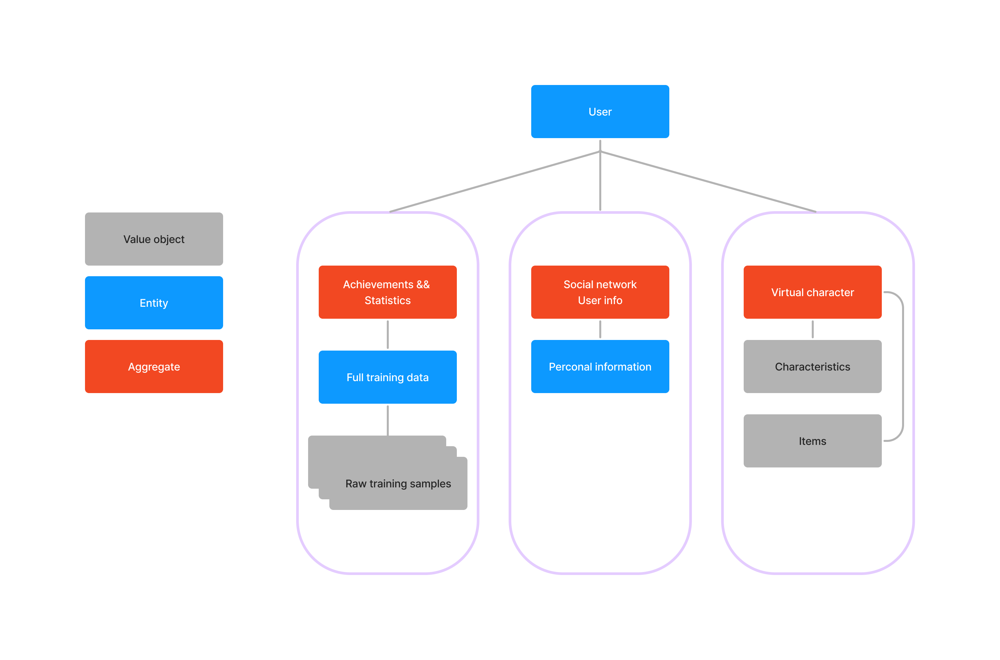

[Heading](../heading.md)

[Previous chapter](13-basic-architecture.md)

[Next chapter](15-risk-analysis.md)

# Основные представления

## Функциональное представление

Функциональное представление соответствует доменной модели и представлено на концептуальной архитектуре.

## Информационное представление

Информация о пользователе в ССС представляет из себя 3 агрегата, как показано на следующем изображении:

## Многозадачность

Многозадачность может быть реализована на разных уровнях: потоки, процессы, сервисы.
Рассмотрим многозадачность на уровне сервисов так как это именно та часть, за которую прежде всего отвечает архитектор ПО.

Система проектировалась с возможностью горизонтального масштабирования. Stateless сервисы без проблем масштабируются, а stateful сервисы должны иметь возможность сохранять своё состояние в базу данных для возможности горизонтального масштабирования.

Масштабируемость базы данных происходит при помощи механизма шардирования. Также предусмотрена возможность замены на базу данных, которая не поддерживает шардирование. Для этого случая у нас есть прослойка, которая может обеспечить данную функциональность

Что касается наших приложений, то проблем с параллелизмом не предполагается. При росте нагрузки провайдер увеличит количество инстансов нашего приложения для уменьшения latency клиентских запросов. Большое количество одновременных работающих веб приложений не помешают друг другу, так как приложения не должны хранить какие-либо состояния. Все состояния хранятся в базе и все приложения имеют доступ до базы.

Шардирование не совсем подходит, в случае частых сложных запросов, которые требуют доступ к более чем одному data shard-у. Каждый такой случай нужно разбирать отдельно.

Kafka должна иметь несколько разделов. Workout data processing сервис должен обрабатывать один или несколько kafka разделов и записывать в базу данных также по разделам (не обязательно способы разделения должны совпадать). Так мы получаем независимое разделение.
Выглядеть это будет следующим образом:

## Инфраструктурное представление

Инфраструктурные вопросы мы отдаём на outsourcing, но вот список инфраструктурных решений, к которым мы стремимся. Список может быть подвергнут изменениям outsourcing компанией.
1. Kubernetes -- для развёртывания и управления приложениями. Тут же мы будем использовать health check-и. 
   * Prometheus -- метрики
   * AlertManager -- триггеры, алерты
1. Grafana -- фронтенд для логов и метрик
1. Prometheus -- метрики
1. Clickhouse -- хранение логов и метрик
1. envoy - в качестве API gateway. Для реализации всех компонентов нам необходимо будет дополнительно:
   * Реализовать [External Authorization](https://www.envoyproxy.io/docs/envoy/latest/intro/arch_overview/security/ext_authz_filter)
   * Использовать плагин для envoy, обеспечивающий дополнительную безпасность: [curiefense](https://www.curiefense.io/)
1. istio - в качестве service mesh. Использует envoy внутри себя и отлично подходит под балансировку gRPC протокола.

## Безопасность

При разработке ПО важно помнить о безопасности, в особенности проверить, что наши системы не подвережены OWASP Top 10 уязвимостям. Также важно обеспечить своевременность обновления ПО.

Значительную часть функционала безопасности реализует именно API Gateway. Важно настроить envoy, чтобы доступ к системе был только через https. Модуль curiefense предоставляет нам WAF с необходимой нам защитой.

Единственное, чего нет в нашем API Gateway - data leak prevention механизма. Этот вопрос нужно будет обсудить с outsourcing кампанией.

Все внутренние сервисы находятся внутри VPN, поэтому мы можем не беспокоиться, что общение между нашими серверами будет перехвачено.

Данные баз данных хранятся в зашифрованном виде. В MongoDB enterprise есть функционал "Encryption at Rest", который использует симметричное шифрование перед записью данных в файл.
